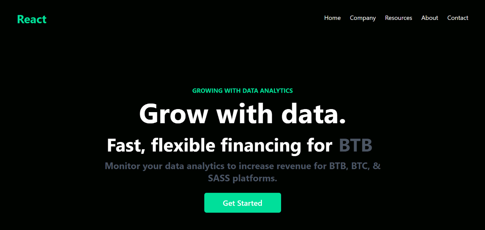

# REACT LANDING PAGE

Check out the live site [here](https://6492455d16966302be32be65--unrivaled-unicorn-598a98.netlify.app/).

## Features

- Fully responsive design to ensure optimal viewing experience across different devices and screen sizes.
- Mobile-friendly menu that slides in from the left side of the screen.
- Integration of React Icons for adding icons to the UI.
- Implementation of React Type Animation package for engaging typewriter-style animations.

## Installation

1. Clone the repository: `git clone https://github.com/waseemazmy21/react-landing-page`
2. Navigate to the project directory: `cd portfolio-app`
3. Install dependencies: `npm install`

## Usage

1. Start the development server: `npm run dev`

## Build and Preview

1. Build the project: `npm run build`
2. Preview the production build: `npm run preview`

## Technologies Used

- Vite: Fast and lightweight build tool for modern web applications.
- React: JavaScript library for building user interfaces.
- Tailwind CSS: Utility-first CSS framework for rapid UI development.
- React Icons: Library for using popular icon sets in React projects.
- React Type Animation: Package for creating engaging typewriter-style animations.

## License

This project is licensed under the MIT License. See the [LICENSE](./LICENSE) file for more information.
